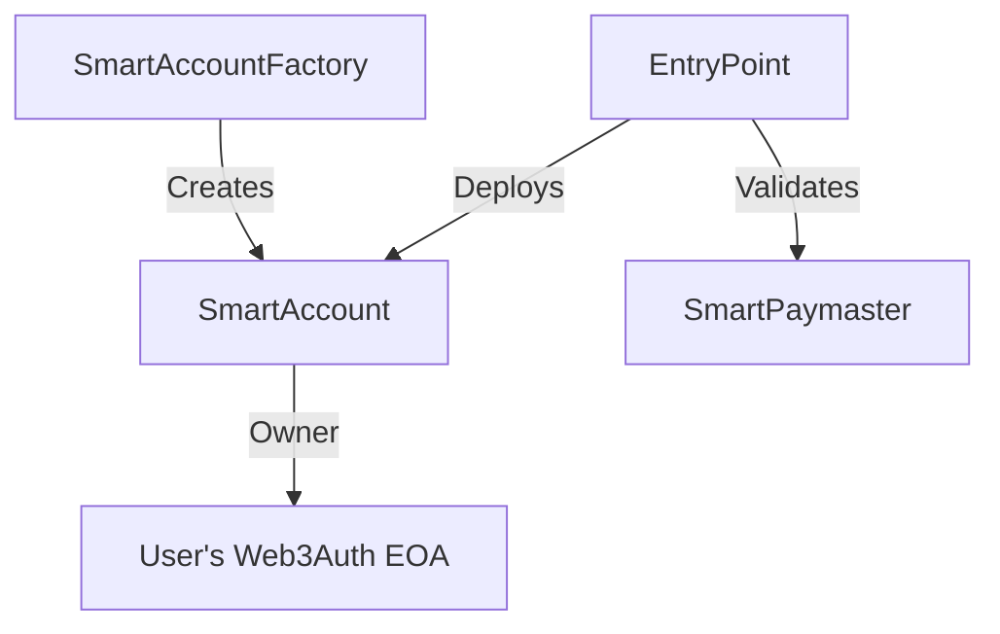

# SurfWallet - Smart Social-First Wallet

 *(placeholder for actual banner image)*

## Introduction

SurfWallet revolutionizes Web3 onboarding by combining social logins with smart contract wallets, eliminating seed phrase hassles while maintaining full self-custody. Built on ERC-4337 Account Abstraction with gas sponsorship, it delivers a Web2-like experience in Web3 applications.

## Key Features

### 🚀 Seamless Onboarding
- **Social Login Integration** via Web3Auth (Google, Twitter, Discord, etc.)
- **No Seed Phrases** - Fully non-custodial without private key management
- **Instant Wallet Creation** - Smart contract wallet deployed on first transaction

### 💰 Gasless Experience
- **Sponsored Transactions** via custom SmartPaymaster contract
- **Batch Operations** - Multiple actions in one gas-sponsored transaction
  
### 🔐 Advanced Security
- **Social Recovery** *(Coming Soon)* - Recover access via trusted contacts
- **Multi-Sig** *(Coming Soon)* - Collaborative fund management
- **Transaction Insights** - Clear signing requests with simulation

## Architecture Overview

### Smart Contracts


### System Components
1. **Frontend**: React-based dashboard with social login
2. **Bundler**: Custom ERC-4337 bundler service
3. **Paymaster**: Gas sponsorship infrastructure
4. **Contracts**: ERC-4337 compliant smart accounts
5. ### Core Contracts
- **SmartAccount.sol**: Minimalist ERC-4337 smart account
- **SmartAccountFactory.sol**: CREATE2 wallet deployer
- **SmartPaymaster.sol**: Gas sponsorship logic

## Technical Specifications

### Contract Addresses (Devnet)
| Contract | Address |
|----------|---------|
| EntryPoint | `0xB3dFDDdf64D291d828891d4B6593747f12861ea1` |
| SmartAccountFactory | `0x9406Cc6185a346906296840746125a0E44976454` |
| SmartPaymaster | `0xeC17FE9bFc20a38bBEC869ECED85603Cd1Fb9d34` |


## Getting Started

### Prerequisites
- Next.js
- Node.js v18+
- Express.js
- Redis server (for bundler userOp mempool)
- Foundry (for contract deployment)

### Installation
```bash
# Clone repository
git clone https://github.com/yourorg/surfwallet.git
cd surfwallet

# Install dependencies
npm install
```

### Environment Setup
Create `.env` files in each directory with these key variables:

#### Frontend (.env)
```env
VITE_WEB3AUTH_CLIENT_ID=your_web3auth_key
VITE_ENTRYPOINT_ADDRESS=0xB3dFDDdf...
VITE_FACTORY_ADDRESS=0x9406Cc61...
VITE_BUNDLER_URL=http://localhost:3001
```

#### Bundler (.env)
```env
PHAROS_RPC=https://devnet.dplabs-internal.com
ENTRY_POINT=0xB3dFDDdf...
PAYMASTER_ADDRESS=0xeC17FE9b...
REDIS_URL=redis://localhost:6379
```

## Running the System

### Development Mode
```bash
npm run dev
```

### Production Deployment
```bash
# Build and deploy
npm run build
```

## Roadmap

### Next Features
- [ ] Social recovery with guardian network
- [ ] Multi-signature transaction approvals
- [ ] Fiat onramp integration
- [ ] Cross-chain transaction bundling

## License
SurfWallet is released under the [MIT License](LICENSE).

---

> **Note**: For production deployment, ensure proper security audits of all smart contracts and infrastructure components. This implementation is currently in beta stage.
